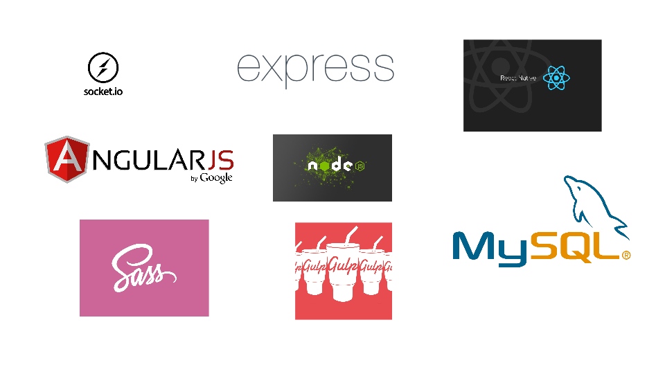

#Challengr
  **Challengr** is a social challenging app where you can challenge your friends to complete the tasks that are long overdue and help them achieve their goals.
  
  Check **Challengr** out on [challengr.io](http://challengr.io). Also check out the repo for our mobile app built in React Native [here](https://github.com/hacksquare/Challengr-Native)

  

##Specifics
  The special thing about **Challengr** is the incentive system. Every time you challenge a friend you put a donation (normally a small amount) to a charity that you choose on the line. If the challenged completes the challenge the money goes to the charity. If he does not though the money goes back to the challenger and the charity misses out. The newsfeed puts the completed as well as non completed challenges into the spotlight. Everyone can see that you missed to complete the challenge and that the money did not go to charity. The approach is backed by the famous self-determination theory and makes it much easier for your friends to complete important milestones in their lifes.

##Requirements
  - Node 4.0.x
  - Bower 1.6.x

##Technologies
  

##Development

###Contributing
  Thank you for taking interest in contributing! In order to contribute please make yourself familiar with our Contribution and Style Guide. Check out our [Style Guide](docs/STYLE-GUIDE.md) and the [Tools](docs/TOOLS.md) we use to adhere to that Style Guide. Also please strictly follow our [Commit Message Guide](docs/COMMIT-MESSAGES.md) and [Workflow](docs/GIT-WORKFLOW.md) otherwise your pull requests will not be accepted.

###Installing Dependencies
  From the project root directory run
    ```
    npm install
    ```
    and
    ```
    bower install
    ```

##Team
  - Faisal Al Qasimi
  - Kevin Aujla
  - Robert Velasco
  - Jordan Winkelman
  - Arthur Mathies

